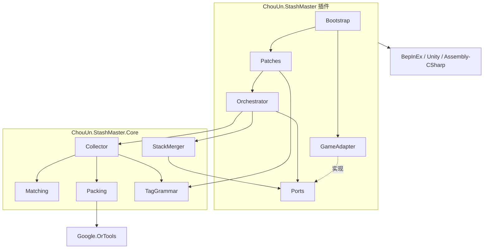
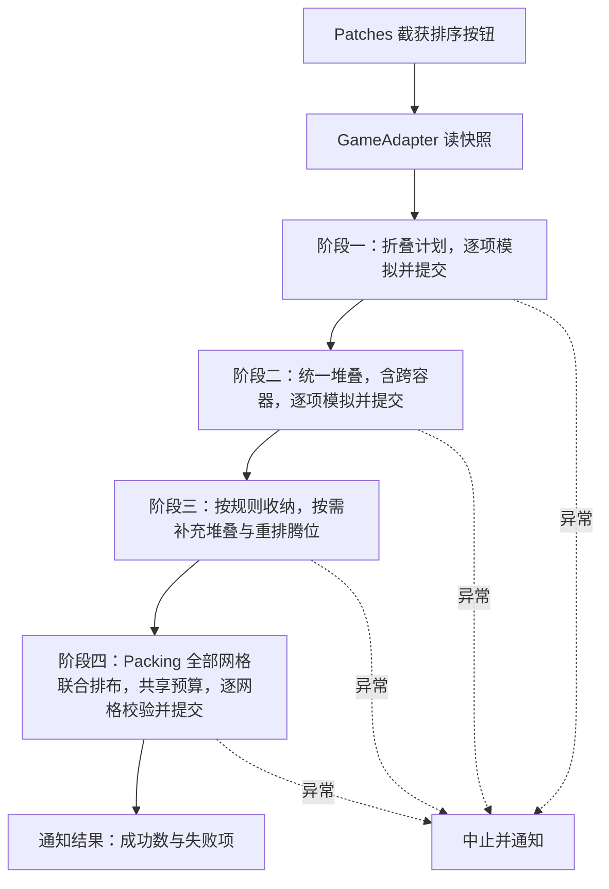

# Stash Master 总体设计

> Parent: [index.md](index.md)
> Related: [requirements.md](requirements.md)

一键整理仓库的 SPT 客户端 mod。本文只定模块边界、依赖方向和核心数据流，
tag 语法与各阶段算法的精确契约放 `feats/`，实施顺序放 `plans/`。

本文的统一堆叠流程包含跨容器堆叠；收纳联合选择目标容器的多个网格。
实现与验收进度见 [收纳优化计划](plans/collection-optimization.md)。

## 术语

| 术语 | 含义 |
| --- | --- |
| 收纳 | 按 tag 规则决定物品进哪个容器，并移动过去 |
| 排布 | 决定物品的位置与转置，收纳时联合选择网格，减少碎片空位 |
| 整理 | 由编排层统一组织折叠、合并堆叠、收纳与排布的一次执行 |
| 规则 | 一条 `@o[#<order>] <expr>;`，含优先级与匹配表达式 |
| 快照 | 从游戏读出的容器树、物品描述与锁状态的纯数据副本 |
| 计划 | 纯算法算出的一组待执行变更：折叠哪些、移到哪、放在哪 |

## 设计目标

- 纯算法与游戏隔离：解析、匹配、调度、排布不依赖 Unity 与游戏程序集，
  能在普通 .NET 测试里跑。
- 先模拟再落地：任何变更先经游戏的 simulate 校验，通过后才提交。
- 阶段顺序固定：先折叠、统一堆叠（含跨容器）、收纳、排布，由编排层统一驱动。
  堆叠阶段统一处理整理范围内的合法来源与接收方，范围见需求 F8 与第 6 节。
- 空间利用率优先，堆叠是节省空间的手段；空间收益相同时尽量保留原容器归属。
  不要求每个容器保留原有数量，也不以合并次数为目标。
- 求解器可替换：CP-SAT 与启发式实现同一装箱接口，启发式同时是退路。
- 收纳只优化装入面积；最终排布保留全部物品，再优化占用高度和父子类别聚合。
  收纳达到面积上限即停止，腾位只服务于增加收纳量，不提前压紧或聚合。
- 最终排布在每个网格内按占用高度、从父到子的各层类别跨度之和加权，
  再以占用格子的行坐标和、列坐标和依次偏好向上、向左；权重仅由本网格确定，最后累加完整分数。
  聚合模型共同处理单格与大件：SortType 是唯一顶层，类型内部手册子链末端追加 TemplateId 虚拟类别，再裁剪、压缩。
  数量与几何模型使用同一棵树，顶层顺序与聚合共用节点范围，不保留原生旧顶层目标。
- 排布层隔离物品身份：等价物品以匿名位置槽求解，布局确定后优先保留原位 ID，
  再把真实物品的位置变更交给编排与游戏适配层。
- 最终排布统一规划全部待整理网格，准备保底与压紧提示后，一次联合求解仍可改善的网格，共享剩余预算；
  规划完成后按原网格对应关系校验与提交，物品归属不变，不为每个容器追加时限。
- 聚合前置提示按类别、行和转置后尺寸对已有占位作数量分配，支持全网格交换；
  提示不改变固定障碍、物品归属或占用几何，后续联合几何模型仍可重新决定各网格内的全部位置。
- 游戏规则只问游戏：可折叠、锁、容器过滤的判定来自游戏，本 mod 不维护清单。

## 模块划分

两个程序集加两个测试工程。Core 不引用任何游戏或 Unity 程序集。
目录用短名，程序集名在 csproj 里指定。

| 目录 | 程序集 | 内容 |
| --- | --- | --- |
| `src/Core/` | `ChouUn.StashMaster.Core.dll` | 纯算法与编排 |
| `src/Plugin/` | `ChouUn.StashMaster.dll` | BepInEx 插件：适配、界面、启动 |
| `tests/Core.Tests/` | 测试 | Core 的单元测试 |
| `tests/Plugin.Tests/` | 测试 | 使用实际 Harmony 验证兼容逻辑，隔离 Unity 与游戏 |

| 模块 | 程序集 | 职责 |
| --- | --- | --- |
| TagGrammar | Core | tag 文本解析为规则列表；错误带位置，供编辑提示使用 |
| Matching | Core | 规则表达式对物品描述求值 |
| Collector | Core | 按规则优先级调度，联合目标原有物品选择收纳组合 |
| StackMerger | Core | 统一规划容器内及跨容器堆叠，兼容性与实际数量由游戏确认 |
| Packing | Core | 装箱接口；CpSat 实现处理大件，Heuristic 实现处理 1×1 与退路 |
| Orchestrator | Core | 统一驱动整理各阶段：取快照、算计划、模拟、提交 |
| Ports | Core | 编排层对外的接口：读快照、模拟与执行变更、提交事务、通知 |
| GameAdapter | 插件 | 实现 Ports：把游戏对象转成快照，把计划翻译成游戏操作 |
| Patches | 插件 | Harmony 补丁：替换原生排序按钮，放宽 tag 长度，保存时解析并提示 |
| Bootstrap | 插件 | 启动顺序：先准备原生库搜索路径，再注册补丁与配置 |

## 依赖关系

- 插件依赖 Core，Core 不依赖插件。
- Core 内只有 Packing 的 CpSat 实现依赖 Google.OrTools。
- 游戏程序集只被插件引用。
- UIFixes 为可选共存插件。兼容处理留在 Plugin 侧，Core 不引用 UIFixes；
  合并堆叠通过游戏 API 执行，不依赖 UIFixes 的私有实现。

## 数据流：一次整理

用户点击容器面板上的排序按钮，触发对该容器的整理。
从快照逻辑展平物品，保留容器层级、位置、规则和锁信息，不实际清空容器。
按游戏事务结果更新状态，并在必要时重新读取；
后续阶段使用折叠后的尺寸及堆叠后实际剩余的物品、数量和位置。

- 快照是纯数据：容器树、每个物品的类别链、名称、FiR、尺寸、可折叠、锁状态、tag 文本。
- 本地化完整类别链仍用于 tag 匹配，不受排序分类边界影响。
  适配层从运行时手册读取 ID 链，按 SortType 对应边界转换为 SubcategoryPath；
  Core 只构建类型内部子树，跨类迁入的物品不携带旧祖先。边界契约见排布文档。
- Collector 向 Packing 提供堆叠后目标保留的物品与同规则候选，
  目标保留的物品必留，候选可不选中，只最大化收纳面积。
  新候选联合选择网格，目标原有物品在所属网格内重排。
  GameAdapter 应用腾位布局后，把选中的候选移到规划位置；
  最终排布负责统一压紧与类别聚合。
- 求解只接触快照，在后台运行；游戏对象访问与事务应用留在游戏线程。
  收纳最多使用 2 秒预算，最终排布使用整次 3 秒的剩余额度。
- Pinned 与 Locked 物品在快照中标出，Collector 与 Packing 都把它们当作固定占位。
- StackMerger 在收纳前统一考虑根容器与带有效规则容器内的堆叠，
  可以跨容器转移数量以释放占格，按游戏事务实际结果更新物品状态。
  Pinned 只接收数量补充，Locked 子树跳过；不会调用 UIFixes 的合并或排序流程。
- 收纳过程中产生的新堆叠仍按需补充，不能用这一补充替代收纳前的统一堆叠阶段。
- 每项变更先由 GameAdapter 以 simulate 模式执行，通过才提交为一次网络事务。
  未通过模拟的单项放弃并记入结果，阶段继续；只有异常才中止整理。
- 一次整理内共用 tag 解析结果、物品索引和堆叠索引。
  普通事务按结果更新索引，失败后重新读取校准；移动容器后刷新层级状态。
  条件匹配缓存只在物品属性未变时复用，最终排布重新读取游戏快照。

## 数据流：编辑 tag

保存 tag 时 Patches 调 TagGrammar 解析，解析结果或错误位置直接呈现给用户。
这条路径不经过 Orchestrator，也不改动任何物品。

## 关键约束

- Core 不得引用 BepInEx、UnityEngine、Assembly-CSharp。游戏事实只能以快照数据进入。
- 插件不得包含匹配、调度、排布逻辑；发现需要这类判断时，把数据加进快照交给 Core。
- 可折叠、锁状态、容器是否接受某物品，由 GameAdapter 问游戏后写进快照，
  Core 不复制游戏规则。
- 未通过 simulate 的变更不得提交。
- 触碰任何原生求解器类型之前，Bootstrap 必须已加载原生入口及其依赖；
  失败的 P/Invoke 初始化在进程内不可恢复。
- 阶段顺序与阶段内算法的选择封装在 Core，插件不感知。
- 一次排序触发只启动一条整理流程，由本 mod 统一管理忙碌状态与结果通知。
  与 UIFixes 共存时停用其冲突入口，保留其他功能和配置。
- 正式整理不调用 UIFixes 的 Sort 或原生排序计算；游戏的布局事务通道仍可复用。
  Debug 诊断可在独立缓冲上调用原生排序计算进行对比，不写真实库存，
  不占求解预算；Release 排除诊断入口和实现。
